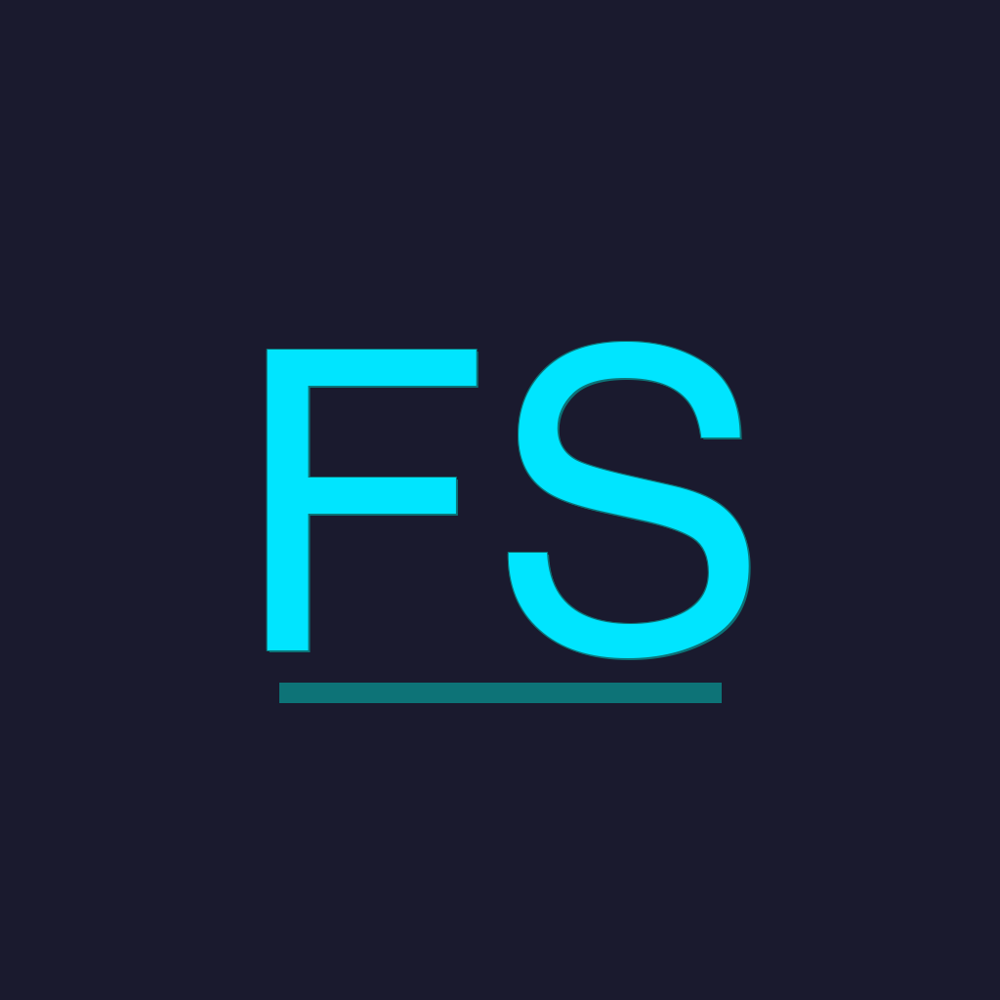

<p align="center">
  <a href="https://apps.apple.com/us/app/fitness-stream/id6759740524">
    
  </a>
</p>

<h1 align="center">Fitness Stream (Proof of Concept)</h1>

<p align="center">
  Stream live workout metrics from your iPhone into OBS overlays — heart rate, pace, distance, GPS minimap, and more — entirely self-hosted on your own machine, for free.
</p>

<p align="center">
  <a href="https://apps.apple.com/us/app/fitness-stream/id6759740524">
    
  </a>
</p>

<p align="center">
  Demo livestream: <a href="https://youtube.com/live/KvPspU89zE4">youtube.com/live/KvPspU89zE4</a>
</p>

<br/>


## How It Works

```
┌────────────────┐  POST /       ┌───────┐  SSE /events  ┌──────────────────┐
│   iPhone App   │ ────────────▶ │  API  │ ────────────▶ │  Client website  │
│ (FitnessStream)│               └───────┘               │     (React)      │
└────────────────┘                                       └────────┬─────────┘
                                                                  │
                                                       OBS Browser Source
                                                                  │
┌────────────────┐  RTSP         ┌────────────┐                   ▼
│  Video source  │ ────────────▶ │ Moblin App │ ─── RTSP ───▶ ┌──────────────────────────┐
│ (iPhone/GoPro) │               │  (iPhone)  │               │          OBS             │
└────────────────┘               └────────────┘               │  • Camera via RTSP       │
                                                              │  • Overlays via Browser  │
                                                              └──────────────────────────┘
```

There are four pieces to set up:

| #   | Component              | What it does                                                                            | Runs on                      |
| --- | ---------------------- | --------------------------------------------------------------------------------------- | ---------------------------- |
| 1   | **API**                | Receives metrics from the iPhone app and broadcasts them as a Server-Sent Events stream | External service             |
| 2   | **Client website**     | React app that renders live widgets (HR, pace, map, etc.) from the SSE stream           | Your Mac/PC (served by Vite) |
| 3   | **OBS Browser Source** | Loads the client website directly inside OBS as a transparent layer                     | OBS on your Mac/PC           |
| 4   | **OBS RTSP Source**    | Receives the live camera feed from Moblin, sourced from an iPhone or GoPro              | OBS on your Mac/PC           |

## Prerequisites

- **Node.js 18+** — [nodejs.org](https://nodejs.org)
- **OBS Studio** — [obsproject.com](https://obsproject.com)
- **Moblin** — free from the iOS App Store ([moblin.camera](https://moblin.camera))
- **FitnessStream** — the companion iOS app (see [iOS App Setup](#ios-app-setup) below)
- iPhone and Mac/PC on the same local network (or use a [tunnel](#5-secure-external-access) for remote)

---

## 1. Local API Server

The API server is a zero-dependency Node.js process. It accepts JSON metrics via `POST /` from the iPhone app and re-broadcasts them to any connected overlay client via `GET /events` (Server-Sent Events).

```bash
cd local
node server.js
```

On startup it prints your local IP and the ports to use:

```
FitnessStream receiver listening on port 8080
Set the app endpoint to:  http://192.168.1.42:8080/
SSE overlay endpoint:     http://localhost:8080/events
Waiting for workout data...
```

To change the port:

```bash
PORT=3000 node server.js
```

**Testing without an iPhone.** The repo includes a mock emitter that simulates a workout:

```bash
# In one terminal — start the server
node server.js

# In another terminal — start the emitter
node emitter.js
```

Or run both at once:

```bash
npm start
```

---

## 2. Overlay Client App

The overlay is a React + Vite app that subscribes to the SSE stream and renders draggable, configurable widgets.

```bash
cd overlays
npm install
npm run dev
```

Vite starts at **http://localhost:5173/**. Open it in a browser to see the dashboard with a control bar for toggling widgets, adjusting the SSE server URL, and setting a stream delay.

The dashboard connects to `http://localhost:8080/events` by default. If your API server runs on a different host or port, update the Server URL in the control bar or pass it as a query parameter:

```
http://localhost:5173/?server=http://192.168.1.42:8080/events
```

### Building for production

If you prefer to serve static files instead of running the Vite dev server:

```bash
cd overlays
npm run build
npm run preview
```

This builds to `overlays/dist/` and serves it at **http://localhost:4173/**.

---

## 3. OBS — Overlay as Browser Source

Once both the API server and overlay client are running, add the overlay to OBS:

1. Open OBS and go to the scene you want to add overlays to.
2. In the **Sources** panel, click **+** and select **Browser**.
3. Name it (e.g. "Fitness Overlay") and click OK.
4. Set the **URL** to your overlay address:

   ```
   http://localhost:5173/
   ```

5. Set the **Width** and **Height** to match your canvas (e.g. 1920 x 1080).
6. Check **Shutdown source when not visible** and **Refresh browser when scene becomes active** for clean reconnects.
7. Click OK.

The overlay renders with a transparent background, so only the widgets appear on top of your scene. Use the control bar inside the browser source (or configure via URL params) to pick which widgets to show.

### Tips

- **Single widget mode.** To show just one metric, use the `overlay` query param:

  ```
  http://localhost:5173/?overlay=heartrate&transparent=true
  ```

  Create a separate Browser Source per widget and position them freely in OBS.

- **Stream delay.** If your camera feed has latency, set a matching delay (in ms) in the overlay control bar so the metrics stay in sync with the video.

- **Custom CSS in OBS.** You can add custom CSS in the Browser Source settings to further style the overlay (e.g. `body { background: transparent !important; }`).

---

## 4. OBS — iPhone Camera via RTSP (Moblin)

Moblin turns your iPhone into a wireless camera by streaming RTSP to OBS over your local network.

### Moblin setup (iPhone)

1. Install **Moblin** from the App Store.
2. Open Moblin and tap the **gear icon** to open settings.
3. Under **Stream**, select **RTSP Server** as the protocol.
4. Set a port (default is `7447`) and note your iPhone's local IP (shown in Moblin or under Settings > Wi-Fi).
5. Tap **Go Live** to start the RTSP server.

Your iPhone is now broadcasting an RTSP stream at:

```
rtsp://<iphone-ip>:7447
```

### OBS setup (Mac/PC)

1. In OBS, click **+** in the Sources panel and select **Media Source** (macOS/Windows) or **VLC Video Source** (if available).
2. **Uncheck** "Local File."
3. In the **Input** field, enter the RTSP URL:

   ```
   rtsp://192.168.1.50:7447
   ```

   Replace the IP with your iPhone's actual local IP.

4. Set **Input Format** to `rtsp`.
5. Check **Restart playback when source becomes active**.
6. Recommended: set **Network Buffering** to `1 MB` (or lower) to minimize latency. You can also try `0` for near-zero delay, but this may cause stuttering on unstable connections.
7. Click OK.

You should now see your iPhone's camera feed in OBS. Arrange it behind your overlay Browser Source so the metrics appear on top of the video.

### Reducing latency

- Keep your iPhone and Mac/PC on the same Wi-Fi network (5 GHz band preferred).
- In Moblin, lower the resolution (1080p is plenty) and increase the keyframe interval.
- In OBS, keep the network buffer as low as possible without introducing stutter.
- If using the overlay delay feature, match it to the RTSP latency for synchronized output.

---

## 5. Secure External Access

Everything above works over your local network. If you need to stream from a remote location — or your iPhone is on cellular while your Mac is at home — you need to expose the API server to the internet. Here are three free options.

### Option A: Cloudflare Tunnel (recommended)

Cloudflare Tunnel creates an encrypted outbound connection from your machine to Cloudflare's edge, so you never open a port on your router. Free for personal use. Requires a Cloudflare account and a domain (free domains work).

1. **Install cloudflared:**

   ```bash
   # macOS
   brew install cloudflared

   # Linux
   curl -L https://github.com/cloudflare/cloudflared/releases/latest/download/cloudflared-linux-amd64 -o cloudflared
   chmod +x cloudflared && sudo mv cloudflared /usr/local/bin/

   # Windows — download from https://github.com/cloudflare/cloudflared/releases
   ```

2. **Authenticate with Cloudflare:**

   ```bash
   cloudflared tunnel login
   ```

   This opens a browser to authorize your Cloudflare account and select a domain.

3. **Create a tunnel:**

   ```bash
   cloudflared tunnel create fitness-stream
   ```

4. **Route traffic to your domain:**

   ```bash
   cloudflared tunnel route dns fitness-stream stream.yourdomain.com
   ```

5. **Create the config file** at `~/.cloudflared/config.yml`:

   ```yaml
   tunnel: fitness-stream
   credentials-file: /Users/<you>/.cloudflared/<tunnel-id>.json

   ingress:
     - hostname: stream.yourdomain.com
       service: http://localhost:8080
     - service: http_status:404
   ```

6. **Start the tunnel:**

   ```bash
   cloudflared tunnel run fitness-stream
   ```

Your API server is now reachable at `https://stream.yourdomain.com`. Point the iPhone app's endpoint to `https://stream.yourdomain.com/` and the overlay's server URL to `https://stream.yourdomain.com/events`. The connection is end-to-end encrypted via Cloudflare's TLS.

To expose both the API server and the overlay client, add a second hostname:

```yaml
ingress:
  - hostname: stream.yourdomain.com
    service: http://localhost:8080
  - hostname: overlay.yourdomain.com
    service: http://localhost:5173
  - service: http_status:404
```

### Option B: Tailscale

Tailscale creates a private WireGuard mesh network between your devices. Free for personal use (up to 100 devices). No domain required.

1. Install Tailscale on your Mac/PC and iPhone: [tailscale.com/download](https://tailscale.com/download)
2. Sign in on both devices with the same account.
3. Note your Mac's Tailscale IP (shown in the Tailscale menu bar app, e.g. `100.x.y.z`).
4. Point the iPhone app's endpoint to `http://100.x.y.z:8080/`.

No configuration files, no DNS, no exposed ports. The connection is encrypted via WireGuard. The downside is both devices must have Tailscale installed.

### Option C: ngrok

ngrok gives you a public HTTPS URL that tunnels to a local port. Free tier includes one persistent agent with ephemeral URLs.

```bash
# Install
brew install ngrok    # or download from https://ngrok.com/download

# Authenticate (one-time)
ngrok config add-authtoken <your-token>

# Expose the API server
ngrok http 8080
```

ngrok prints a public URL like `https://abc123.ngrok-free.app`. Point the iPhone app to that URL. Free-tier URLs change every time you restart ngrok, so Cloudflare Tunnel or Tailscale are better for persistent setups.

---

## Quick-Start Checklist

```bash
# Terminal 1 — API server
cd local
node server.js

# Terminal 2 — Overlay client
cd overlays
npm install   # first time only
npm run dev

# Terminal 3 — (optional) Cloudflare Tunnel
cloudflared tunnel run fitness-stream
```

Then in OBS:

- [ ] Add a **Media Source** for the Moblin RTSP stream (`rtsp://<iphone-ip>:7447`)
- [ ] Add a **Browser Source** for the overlay (`http://localhost:5173/`)
- [ ] Start Moblin on iPhone and tap Go Live
- [ ] Start a workout in FitnessStream on iPhone
- [ ] Verify metrics appear in the overlay and camera feed is visible in OBS

---

## iOS App Setup

The FitnessStream iOS app collects live workout data (heart rate, HR zone, active energy, distance, pace, steps, GPS, elevation) and POSTs it as JSON to your configured endpoint every second.

### Requirements

- Xcode 26+ with iOS 26.0+ deployment target
- An Apple Developer account (free or paid) for device builds
- A physical iPhone (HealthKit data is not available in the simulator)

### Build and install

```bash
git clone https://github.com/wildemat/iosFitnessStream.git
cd iosFitnessStream
open FitnessStream.xcodeproj
```

1. Select your Apple Developer team under **Signing & Capabilities**.
2. Connect your iPhone and select it as the build destination.
3. Press **Cmd+R** to build and run.
4. In the app, enter your API server endpoint (e.g. `http://192.168.1.42:8080/` or your tunnel URL).
5. Select a workout type and start the session.

See [PUBLISH.md](PUBLISH.md) for TestFlight and Ad Hoc distribution instructions.

## Project Structure

```
iosFitnessStream/
├── FitnessStream/                  # iOS app (Swift, Xcode project)
│   ├── WorkoutSessionManager.swift # HKWorkoutSession, HealthKit queries
│   ├── StreamClient.swift          # POST JSON metrics to endpoint
│   ├── LocationManager.swift       # CoreLocation for GPS + elevation
│   ├── WorkoutMetrics.swift        # Codable struct for all metric fields
│   └── ...
├── local/                          # Self-hosted API server
│   ├── server.js                   # HTTP server: POST receiver + SSE broadcaster
│   ├── emitter.js                  # Mock workout emitter for testing
│   └── package.json
├── overlays/                       # React overlay client (Vite + TypeScript)
│   ├── src/
│   │   ├── components/             # Widget components (HeartRate, Pace, Minimap, etc.)
│   │   ├── hooks/useMetricsStream.ts  # SSE client with buffered delay support
│   │   ├── store/useLayoutStore.ts    # Zustand store for widget layout state
│   │   └── types/metrics.ts        # WorkoutMetrics type definition
│   ├── package.json
│   └── vite.config.ts
└── README.md
```

## License

Private — not licensed for redistribution.
