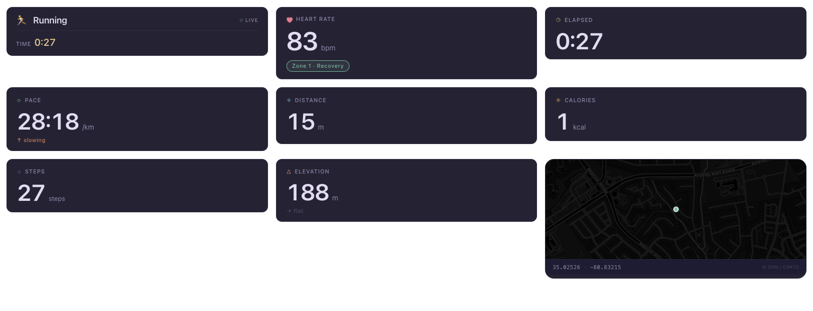
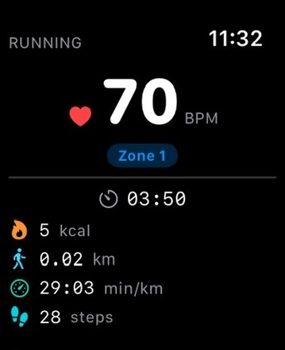
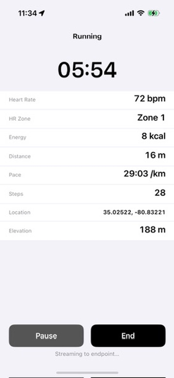
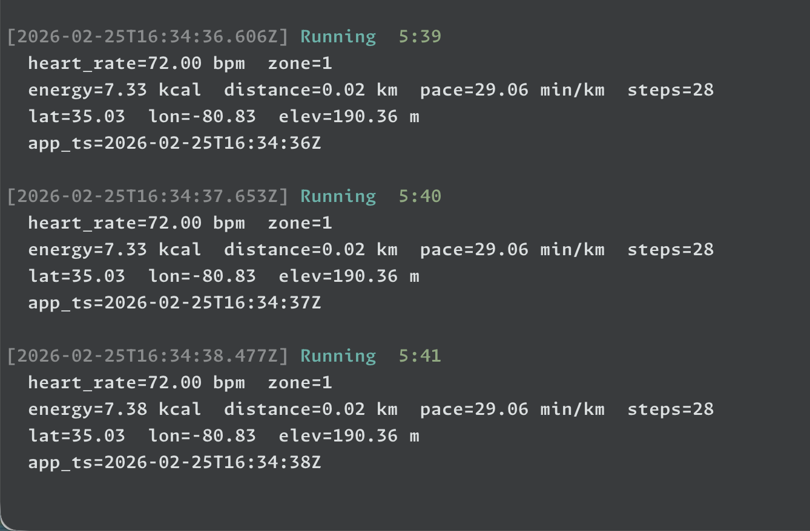

# Fitness Stream Overlays

Real-time workout metric overlays for OBS / streaming, powered by a React + Vite frontend that consumes Server-Sent Events from the companion iOS app.

## URL Parameters

All parameters are passed as query strings on the overlay URL (default `http://localhost:5173/`).

| Parameter     | Type    | Default                         | Description                                                                                              |
| ------------- | ------- | ------------------------------- | -------------------------------------------------------------------------------------------------------- |
| `overlay`     | string  | _(none — shows full dashboard)_ | Which single overlay to display. See values below.                                                       |
| `server`      | string  | `http://localhost:8080/events`  | SSE endpoint URL. Point this at your Mac's IP when the phone and OBS are on different machines.          |
| `zoom`        | number  | _(map default)_                 | Leaflet map zoom level for the `minimap` overlay.                                                        |
| `transparent` | boolean | `false`                         | Set to `true` to remove the card background and border, leaving content floating directly on the stream. |

### `overlay` values

| Value       | Overlay                          |
| ----------- | -------------------------------- |
| `heartrate` | Heart rate (BPM)                 |
| `elapsed`   | Elapsed workout time             |
| `pace`      | Current pace                     |
| `distance`  | Distance covered                 |
| `calories`  | Active calories burned           |
| `steps`     | Step count                       |
| `elevation` | Elevation gain                   |
| `workout`   | Workout type indicator           |
| `minimap`   | Live route map (supports `zoom`) |

Omit `overlay` entirely to get the full 3x3 dashboard grid.

### Examples

```
# Full dashboard
http://localhost:5173/

# Single heart-rate widget
http://localhost:5173/?overlay=heartrate

# Transparent heart-rate widget (no card chrome)
http://localhost:5173/?overlay=heartrate&transparent=true

# Minimap zoomed to street level, pointed at a remote server
http://localhost:5173/?overlay=minimap&zoom=17&server=http://192.168.1.42:8080/events
```

## Storybook

A built Storybook is served at `/storybook` on the same Vite origin:

```
http://localhost:5173/storybook/
```

To include Storybook in the dev server or production build, build it first:

```bash
# Build storybook then start dev server
npm run dev:all

# Build storybook + app together for production
npm run build:all
```

If you only run `npm run dev`, the `/storybook` route will work as long as `storybook-static/` exists from a previous `npm run build-storybook`. The standalone Storybook dev server (with hot reload for stories) is still available at port 6006 via `npm run storybook`.

## Screenshots

### Overlays in browser



### Watch interface



### Phone interface



### Server interface


